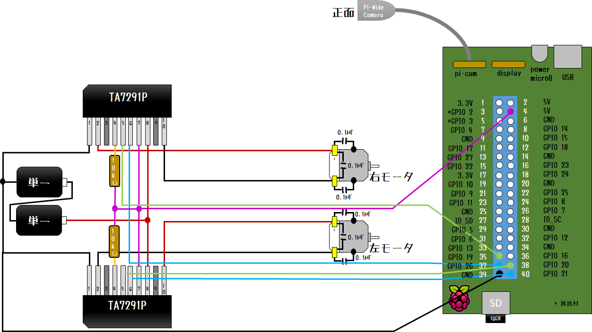

# DCモータを Donkey Carで使う

模型などでよく使用される [マブチモータFC130RA-2270](https://product.mabuchi-motor.co.jp/detail.html?id=9) をDonkey Carの駆動輪用に使用する際のパーツクラスを提供する。


## 前提

### TA7291P DCモータドライバ

本リポジトリでは、DCモータドライバ [TA7291P](http://akizukidenshi.com/catalog/g/gI-02001/) を使用した以下のような回路を組んだ状態とする。


> TA7291P は、IN1/IN2 をデジタルOUTPUTピンとして扱い、VrefをPWMピンとして操作する方法が [データシート](http://akizukidenshi.com/download/ta7291p.pdf) 上では記述されているが、上記のようにIN1/IN2をPWMピンとして操作することも可能である。

複数のモータを操作する場合は、以下のような回路を組むことで対応可能である。３個以上の場合も同様だが、モータ側電源を適正に選択する必要がある。TA7291PのVrefは0Vから20Vまでである。



> DCモータはノイズが大きいため、01μFのコンデンサを使ってノイズ対策を行うことを推奨する。

### pigpio

本クラスではpigpioパッケージを使用している。pigpioパッケージを使用することで、Raspberry Pi上の疑似PWMをハードウェアPWMに近い精度で使用することができる。複数のPWMピンを使用したい場合は、pigpioパッケージの利用を勧める。

インストールするには、以下のコマンドをRaspberry Pi上で実行する。

```bash
$ sudo apt install -y pigpio
$ sudo pigpiod
```

上記のとおり、pigpoiパッケージは、`pigpiod`がRaspberry Pi上で実行されていることが前提となる。

## インストール

- Raspberry Pi上で以下のコマンドを実行する。
   ```bash
   $ cd ~/
   $ git clone https://github.com/coolerking/donkeypart_dcmotor.git
   $ cd donkeypart_dcmotor
   $ pip install -e .
   ```

- `~/mycar/config.py`に以下の設定値を記述する。

|変数名|設定する変数値|
|:----|-------------|
| `MOTOR_IN1_GPIO`|IN1と接続されているGPIOの番号|
| `MOTOR_IN2_GPIO`|IN2と接続されているGPIOの番号|

- `~/mycar/manage.py`を編集して、DCMotorパーツを追加する。

```python

:
# ダミーデータ
V.mem['user/motor/value'] = 0.5
V.mem['user/motor/status'] = 'move'
:

:
from pigpio
pi = pigpio.pi()

from donkeypart_dcmotor import DCMotor
motor = DCMotor(pi, cfg.MONITOR_IN1_GPIO, cfg.MOTOR_IN2_GPIO)
V.add(motor, inputs=['user/motor/value', 'user/motor/status'])
:

```

## Tubデータ

本クラスのDCモータ入力値(`DCMotor.run()`引数を参照のこと)は、以下のとおりである。

|引数名|範囲|説明|推奨キー名|
|:-|:-:|:-|:-|
|`motor_value`|[-1.0, 1.0]のfloat値|正値：正転、負値：逆転となる。最大値は、モータにVsピンと同等の電圧が加わる。本リポジトリのコードではアナログパッドなどの遊びを鑑み、(-0.1, 0.1)の範囲はゼロとして扱っている。|`user/motor/value`|
|`motor_status`|'`move`', '`free`', '`brake`'のいずれか|'`move`'：モータ駆動、 '`free`'：モータ駆動なし、'`brake`'：制動停止|`usrt/motor/brake`|

このため`manage.py`の`TubWriter`引数も合わせて変更する必要がある。以下は例である。
```python

    :
    # recording ダミー入力
    V.mem['recording'] = True
    :
    # Tubデータ・フォーマットも変更しなくてはならない
    inputs = ['cam/image_array', 'user/motor/value', 'user/motor/status', 'timestamp']
    types = ['image_array', 'float', 'str', 'str']

    # single tub
    tub = TubWriter(path=cfg.TUB_PATH, inputs=inputs, types=types)
    V.add(tub, inputs=inputs, run_condition='recording')
    :
```

## オートパイロット

Tubデータの項目が変更になっているので、デフォルトのオートパイロットでは動作しない。

donkeycar パッケージのデフォルト`manage.py`では`donkeycar.part`モジュールにデフォルトのオートパイロットパーツクラス`KerasLinear`が格納されている。

よって、以下のように`kerasLinear`の代替となるクラスを作成する必要がある。

```python
MOTOR_STATUS = ['move', 'free', 'brake']
class MyPilot(KerasPilot):
    def __init__(self, model=None, num_outputs=None, *args, **kwargs):
        super(KerasLinear, self).__init__(*args, **kwargs)
        if model:
            self.model = model
        elif num_outputs is not None:
            self.model = my_default_linear()
        else:
            self.model = my_default_linear()

    def run(self, img_arr):
        img_arr = img_arr.reshape((1,) + img_arr.shape)
        outputs = self.model.predict(img_arr)
        # モータ値：回帰
        left_value = outputs[0][0][0]
        # モータステータス：分類
        left_status = MOTOR_STATUS[np.argmax(outputs[1][0][0])]

        # 操作データを返却
        return motor_value, motor_status


def my_default_linear():
    img_in = Input(shape=(120, 160, 3), name='img_in')
    x = img_in

    # Convolution2D class name is an alias for Conv2D
    x = Convolution2D(filters=24, kernel_size=(5, 5), strides=(2, 2), activation='relu')(x)
    x = Convolution2D(filters=32, kernel_size=(5, 5), strides=(2, 2), activation='relu')(x)
    x = Convolution2D(filters=64, kernel_size=(5, 5), strides=(2, 2), activation='relu')(x)
    x = Convolution2D(filters=64, kernel_size=(3, 3), strides=(2, 2), activation='relu')(x)
    x = Convolution2D(filters=64, kernel_size=(3, 3), strides=(1, 1), activation='relu')(x)

    x = Flatten(name='flattened')(x)
    x = Dense(units=100, activation='linear')(x)
    x = Dropout(rate=.1)(x)
    x = Dense(units=50, activation='linear')(x)
    x = Dropout(rate=.1)(x)

    # 最終全結合層と活性化関数のみ差し替え
    # categorical output of the angle
    #angle_out = Dense(units=1, activation='linear', name='angle_out')(x)

    # continous output of throttle
    #throttle_out = Dense(units=1, activation='linear', name='throttle_out')(x)
    
    # モータ値（回帰）
    value_out  = Dense(units=1, activation='linear', name='value_out')(x)
    # モータ値（分類）
    status_out = Dense(units=len(MOTOR_STATUS), activation='softmax', name='left_status_out')(x)


    #model = Model(inputs=[img_in], outputs=[angle_out, #throttle_out])
    model = Model(inputs=[img_in], outputs=[value_out, status_out])

    #model.compile(optimizer='adam',
    #              loss={'angle_out': 'mean_squared_error',
    #                    'throttle_out': 'mean_squared_error'},
    #              loss_weights={'angle_out': 0.5, 'throttle_out': .5})
    # 回帰、分類別に最適化関数を使い分け
    model.compile(optimizer='adam',
                  loss={'value_out': 'mean_squared_error',
                        'status_out':  'categorical_crossentropy'},
                  loss_weights={'value_out': 0.5,
                        'status_out': 0.5})

    return model
```

モデルのアウトプット層は以下の通り。

|変数名|範囲|説明|
|:-|:-|:-|
|`value_out`|[-1.0, 1.0]の範囲のfloat値|DCモータの電圧値をあらしており、1.0/-1.0の場合、用意されたDCモータ用電圧の最大値が投入される。|
|`status_out`|0,1,2のいずれかのint値|配列`MOTOR_STATUS`のindex値に相当。|


## トレーニング

オートパイロットのアウトプット層を変更したため、`manage.py`の関数`train()`も合わせて変更し無くてはならない。

まずtrain関数の先頭の以下の部分を変更する。
```python
    :
    X_keys = ['cam/image_array']
    y_keys = ['user/motor/value', 'user/motor/status']
    :
```

Tubデータの`motor_status`が文字列であるのに対し、モデルのアウトプット層の所定の変数は0,1,2のint値となっているため、このあたりの変更にも対応し無くてはならない。

しかし`donkeycar`パッケージは、こういった変更に柔軟に対応できるように `TubGroup` が実装されている。ここでは、トレーニングバッチと評価用バッチデータを取得するための関数`TubGroup.get_traun_val_gen`の引数`train_record_transform`と`val_record_transform`に修正する関数`motor_status_transform`を与えることで対応できる。
```python
    :
    tubgroup = TubGroup(tub_names)
    train_gen, val_gen = tubgroup.get_train_val_gen(
        X_keys, y_keys,
        batch_size=cfg.BATCH_SIZE,
        train_frac=cfg.TRAIN_TEST_SPLIT,
        train_record_transform=motor_status_transform,
        val_record_transform=motor_status_transform)
    :
```

関数`motor_status_transform`の定義例は、以下の通り。
```python
MOTOR_STATUS = ['move', 'free', 'brake']
:
def agent_record_transform(record_dict):
    """
    TubGroupクラスのメソッドget_train_val_genの引数として渡し、
    Agent用Tubデータ仕様のものでも学習データ化できるようにする
    マッピング関数。

    引数
        record_dict     もとのレコードデータ（Agent用Tubデータ、辞書型）
    戻り値
        record_dict     AIのinput/output層にあったマッピングが終わったレコードデータ（辞書型）
    例外
        ValueError      モータステータスキーが１件も存在しない場合
    """
    status_val = record_dict['user/motor/status']
    if status_val is not None:
        record_dict['user/motor/status'] = motor_status_to_list(status_val)
    else:
        raise ValueError('no value of key=\"user/motor/status\" in loaded record')
    return record_dict

def motor_status_to_list(val):
    """
    モータステータス値を数値リスト化する。

    引数
        モータステータス値
    戻り値
        数値リスト
    """
    classes = np.zeros(len(MOTOR_STATUS)).tolist()
    classes[MOTOR_STATUS.index(val)] = 1
    return classes
```

## ライセンス

本リポジトリ上のソースコードはすべて [MITライセンス](./LICENSE) 準拠とする。


