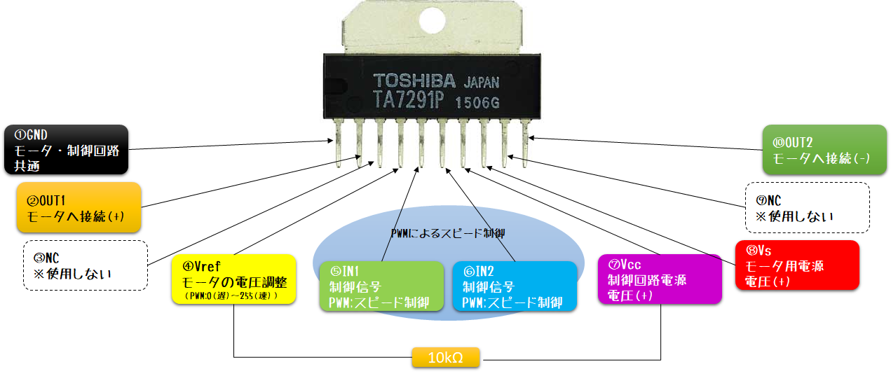

# DCモータを Donkey Carで使う

模型などでよく使用される [マブチモータFC130RA-2270](https://product.mabuchi-motor.co.jp/detail.html?id=9) をDonkey Carの駆動輪用に使用する際のパーツクラスを提供する。


## 前提

### TA7291P DCモータドライバ

本リポジトリでは、DCモータドライバ [TA7291P](http://akizukidenshi.com/catalog/g/gI-02001/) を使用した以下のような回路を組んだ状態とする。



> TA7291P は、IN1/IN2 をデジタルOUTPUTピンとして扱い、VrefをPWMピンとして操作する方法がデータシート上では記述されているが、上記のようにIN1/IN2をPWMピンとして操作することも可能である。

複数のモータを操作する場合は、以下のような回路を組むことで対応可能である。３個以上の場合も同様（ただしモータ側電源を適正に選択する必要がある）。


> DCモータはノイズが大きいため、01μFのコンデンサを使ってノイズ対策を行うことを推奨する。

### pigpio

本クラスではpigpioパッケージを使用している。pigpioパッケージを使用することで、Raspberry Pi上の疑似PWMをハードウェアPWMに近い精度で使用することができる。複数のPWMピンを使用したい場合は、pigpioパッケージの利用を勧める。

インストールするには、以下のコマンドをRaspberry Pi上で実行する。

```bash
$ sudo apt install -y pigpio
$ sudo pigpiod
```

上記のとおり、pigpoiパッケージは、`pigpiod`がRaspberry Pi上で実行されていることが前提となる。

## インストール

- Raspberry Pi上で以下のコマンドを実行する。
   ```bash
   $ cd ~/
   $ git clone https://github.com/coolerking/donkeypart_dcmotor.git
   $ cd donkeypart_dcmotor
   $ pip install -e .
   ```

- `~/mycar/config.py`に以下の設定値を記述する。

|変数名|設定する変数値|
|:----|-------------|
| `MOTOR_IN1_GPIO`|IN1と接続されているGPIOの番号|
| `MOTOR_IN2_GPIO`|IN2と接続されているGPIOの番号|

- `~/mycar/manage.py`を編集して、DCMotorパーツを追加する。

```python

:
# ダミーデータ
V.mem['user/motor/value'] = 0.5
V.mem['user/motor/status'] = 'move'
:

:
from pigpio
pi = pigpio.pi()

from donkeypart_dcmotor import DCMotor
motor = DCMotor(pi, cfg.MONITOR_IN1_GPIO, cfg.MOTOR_IN2_GPIO)
V.add(motor, inputs=['user/motor/value', 'user/motor/status'])
:

```

